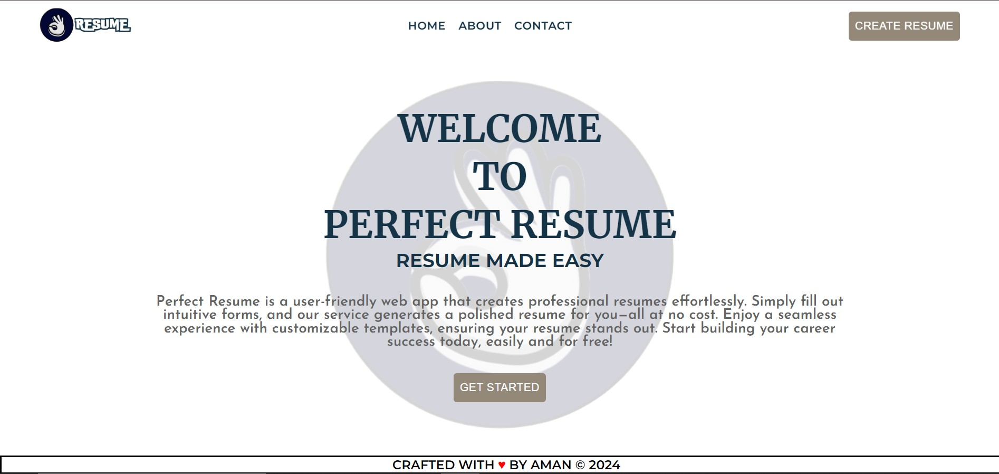
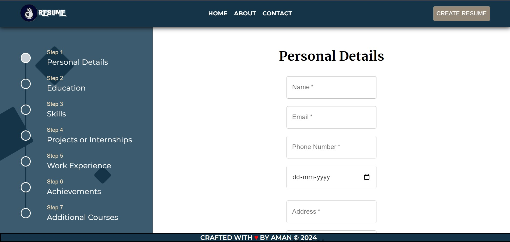

# Perfect Resume Backend :mortar_board:
 Perfect Resume is a user-friendly web app that creates professional
          resumes effortlessly. Simply fill out intuitive forms, and our service
          generates a polished resume for you—all at no cost. Enjoy a seamless
          experience with awesome resumes, ensuring your resume stands
          out. Start building your career success today, easily and for free!

The backend utilizes Node.js and Express.js to support a React application. Check the frontend on [Perfect Resume](https://github.com/Amansingh494/perfect-resume)

    [](https://choosealicense.com/licenses/mit/)

  

  


## Tech Stack :hammer_and_wrench:

**Client:** Node Js, Express Js, Handlebars, Docker, Html to Pdf


## Live Demo 🚀

[](https://perfect-resume.crafted-concepts.tech)

## Table of contents
- [Installation](#installation)
- [Usage](#usage)
- [Features](#features)
- [Contributing](#contributing)
- [License](#license)
## Installation 💻
1. Ensure Node.js is installed on your system. If not, download and install it from [Node.js official website](https://nodejs.org/).
2. Clone the repository:
    ```sh
    git clone https://github.com/AmanSingh494/perfect-resume-backend.git
    ```
3. Navigate to the project directory:
    ```sh
    cd perfect-resume
    ```
4. Install dependencies:
    ```sh
    npm install
    ```
5.   For frontend setup, refer to [Perfect Resume](https://github.com/Amansingh494/perfect-resume).
6. Update the `.env` file with appropriate backend settings. Specify a port number of your choice and adjust `CORS_ORIGIN` to reflect your frontend URL.
7. Run the application:
    ```sh
    nodemon app.js
    ```
    
## Usage

Follow these steps to use the application:

1. First, set up the frontend by following the instructions provided in the [Perfect Resume](https://github.com/Amansingh494/perfect-resume) repository.
2. Start the backend server by running:
    ```sh
    nodemon app.js
    ```
3. Open a web browser and navigate to `http://localhost:3000` to access the application.
4. On the landing page, click on the "Create Resume" button to begin creating your resume.

### Example
Here’s an example of how to use the application:
1. When you start the application, you will see the landing page-


2. Click on the create resume button to start creating a resume, you will see such an interface-


3. Enter all the details and click on submit.

4. Tada!! 🎉 Your resume will be ready in a few seconds.

## Backend Features :sparkles:

The backend of Perfect Resume, built with Node.js and Express.js, offers a robust set of features designed to support the frontend application efficiently. Here are some of the key features:

- **RESTful API Design**: Implements RESTful principles for clear, standardized communication between the frontend and backend, facilitating easy integration and maintenance.

- **Authentication and Authorization**: Implements secure authentication and authorization mechanisms to protect user accounts and personal information, ensuring that users can safely manage their resumes.

- **Error Handling and Logging**: Features comprehensive error handling and logging capabilities to ensure smooth operation and facilitate troubleshooting of any issues that arise.

- **Scalable Architecture**: Designed with scalability in mind, allowing for easy expansion to accommodate growing user bases without compromising performance.

- **Docker Support**: Includes Docker configuration files, making it easy to containerize the application for development, testing, and deployment, ensuring consistency across environments.

- **Environment Variable Configuration**: Utilizes environment variables for configuration, making it easy to adjust settings without changing the codebase, enhancing security and flexibility.

- **Cross-Origin Resource Sharing (CORS) Configuration**: Properly configured CORS settings to ensure the backend can securely communicate with the frontend application hosted on a different domain or port.

- **Comprehensive Testing**: Includes unit and integration tests to ensure each component functions correctly and the entire system works seamlessly together, improving reliability.

These features collectively make the backend of Perfect Resume a powerful, secure, and flexible platform that supports the creation and management of professional resumes.

## Contributing :handshake:

I welcome contributions to the Perfect Resume project! If you're looking to contribute, here's how you can help:

### Reporting Issues :warning:

If you encounter any bugs or have suggestions for improvements, please file an issue through the GitHub issue tracker. Be sure to include a clear title, a detailed description, and steps to reproduce the issue if applicable.

### Submitting Changes

1. **Fork the Repository**: Start by forking the repository on GitHub.
2. **Clone Your Fork**: Clone your fork to your local machine for development.
    ```sh
    git clone https://github.com/AmanSingh494/perfect-resume-backend.git
    cd perfect-resume-backend
    ```
3. **Create a New Branch**: Create a branch for your changes. Naming it something descriptive can be helpful.
    ```sh
    git checkout -b feature/your-feature-name
    ```
4. **Make Your Changes**: Implement your changes, add new features, or fix bugs.
5. **Test Your Changes**: Ensure your changes do not break any existing functionality. Add any new tests if necessary.
6. **Commit Your Changes**: Commit your changes with a clear commit message.
    ```sh
    git commit -m "Add a concise and descriptive message about your change"
    ```
7. **Push to Your Fork**: Push your changes to your fork on GitHub.
    ```sh
    git push origin feature/your-feature-name
    ```
8. **Submit a Pull Request**: Go to the original project repository on GitHub and submit a pull request from your feature branch to the main project's `main` branch.

### Code of Conduct

Please note that this project is released with a Contributor Code of Conduct. By participating in this project, you agree to abide by its terms.

### Getting Help

If you need help with making contributions or setting up the project, feel free to reach out or ask questions in the project's discussions section on GitHub.

I look forward to your contributions!

## License

Perfect Resume is open-sourced software licensed under the MIT license. The MIT license is a permissive license that is short and to the point. It lets people do anything they want with your code as long as they provide attribution back to you and don’t hold you liable.

For more details, see the [LICENSE](./LICENSE) file in the repository.
